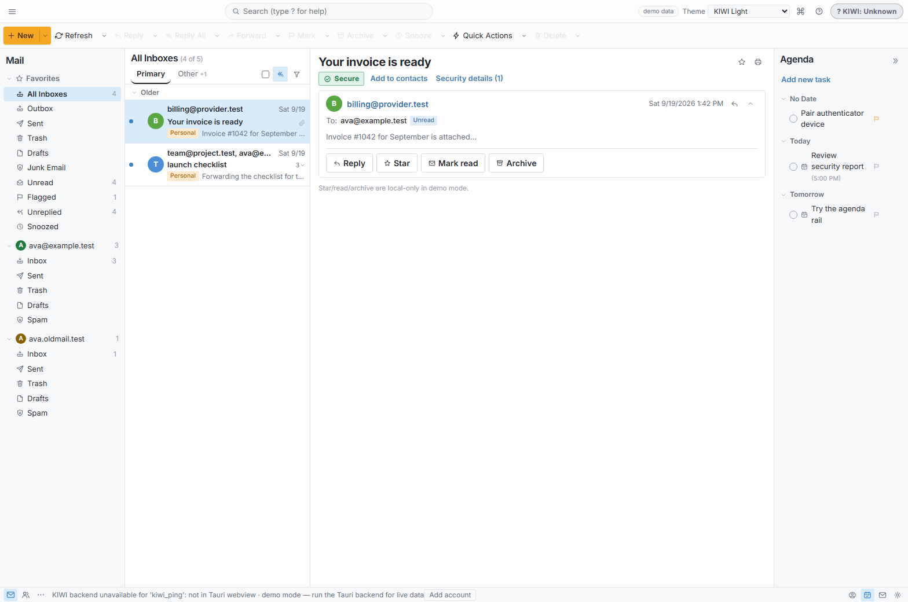
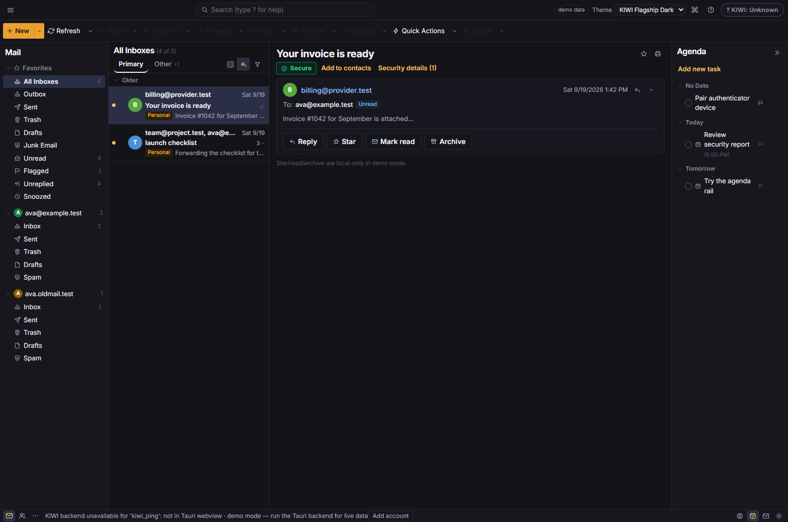
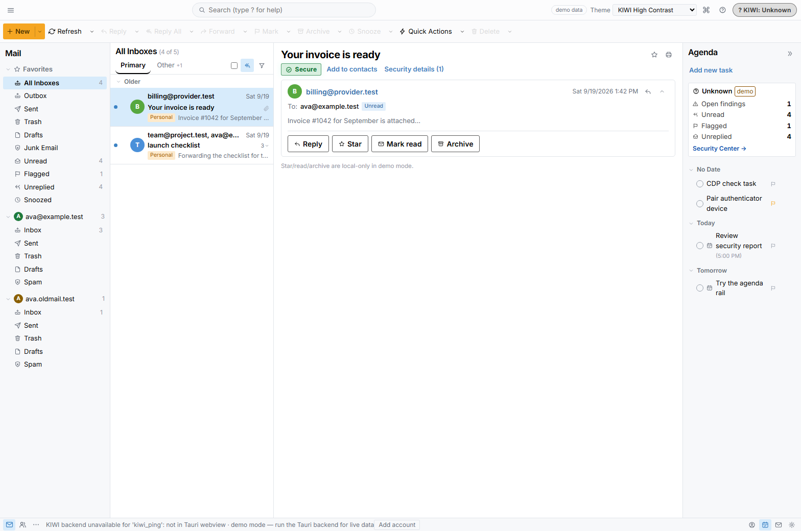
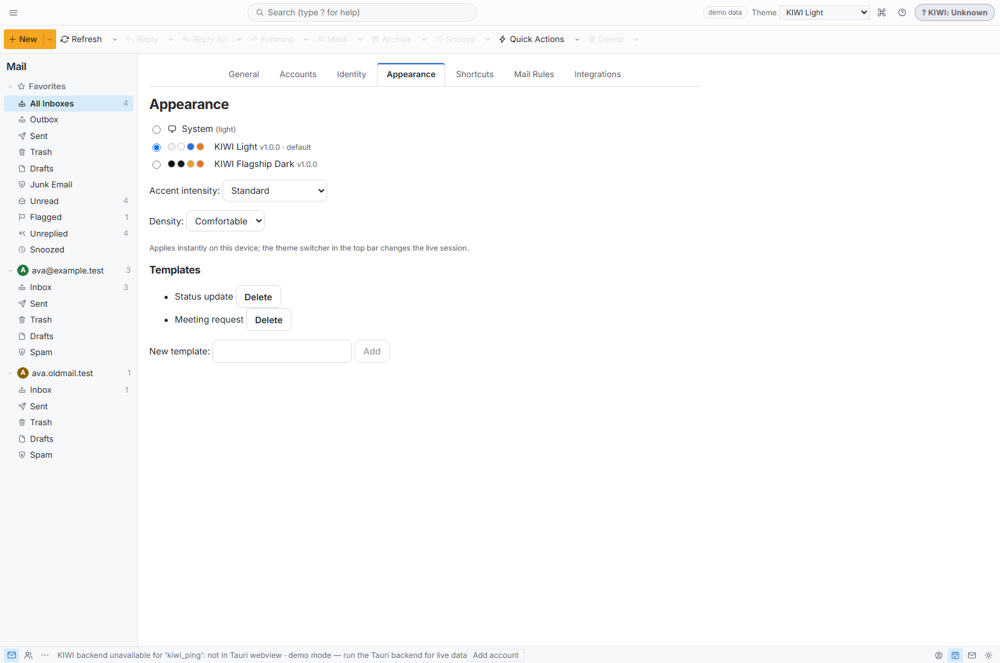
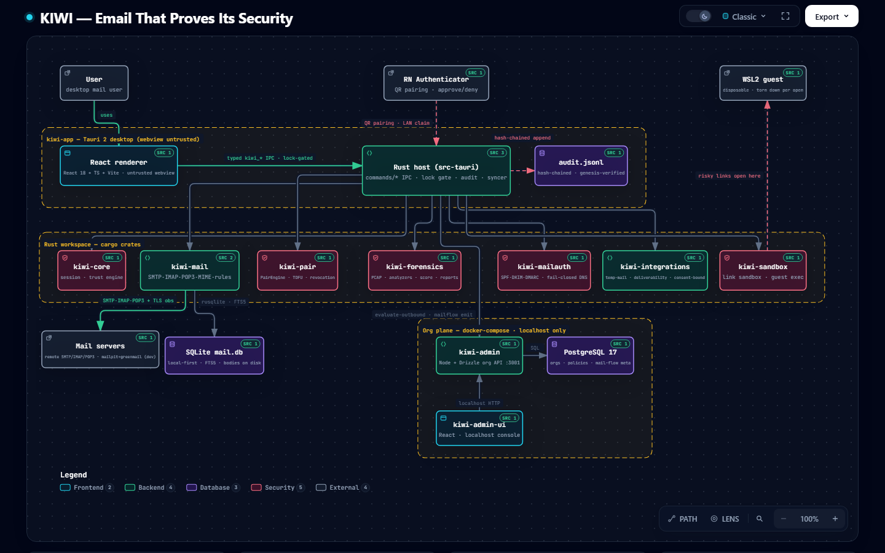

<p align="center">
  
</p>

<h1 align="center">KIWI</h1>

<p align="center">
  <strong>Email that proves its security.</strong><br/>
  A full-featured desktop mail client and security platform in one - real SMTP, IMAP and POP3,<br/>
  with deterministic transport evidence, endpoint trust, an independent authenticator,<br/>
  tamper-evident audit and organization controls built in.<br/>
  <em>Every claim is evidence-backed; AI explains but never asserts.</em>
</p>

<p align="center">
  
  
  
  
</p>

---

## What is KIWI?

KIWI is an independent desktop email client built from scratch - **not** a Thunderbird or Mailspring fork ([ADR-005](docs/DECISIONS.md)). Thunderbird is the workflow/UX reference and Mailspring the productivity reference, both kept read-only under `source/` and `reference/` and never shipped. It looks and behaves like a normal, full-featured mail client - four-pane mailbox, unified inbox, compose with undo-send and send-later, search, contacts, attachments, rules, multiple accounts - while quietly doing the security work most clients skip: every connection is captured, scored by deterministic rules, and recorded as evidence. Its tagline is the design rule: **email that proves its security**. Absent data renders absent; the UI never paints a fake green.

## Features

### Mail that feels like a real client

Four-pane shell (folder tree with smart counts, tabbed and grouped message list, thread-card reader, agenda rail), quick-filter chips, multi-select, drag-to-folder, context menus, reply prefill, snooze, templates, and unified inboxes across accounts.



*Captured in demo mode with the Tauri backend unreachable. The UI badges the data as demo rather than faking live state.*

### Three themes, one truth

Light is the default theme; dark and a high-contrast palette ship alongside it. The same evidence renders the same way in every theme - a theme change is presentation, never a different verdict.





*High contrast with the security strip expanded: unknown trust state, open findings, unread, flagged and unreplied counts, and the Security Center entry point.*

### Settings you can actually operate

Nine settings tabs (General, Accounts, Identity, Appearance, Shortcuts, Mail Rules, Integrations, Plugins, About) with live theme switching, accent and density controls, and a persisted template store.



### The security spine

- **Deterministic transport evidence.** Every SMTP/IMAP/POP3 connection yields a `TlsObservation` (`kiwi-mail/src/transport.rs`): TLS version, cipher suite, key exchange, forward secrecy, chain, STARTTLS behavior. Captured at the protocol layer, not inferred.
- **Rule-driven findings.** `kiwi-forensics` turns session evidence into findings with reproducible evidence attached. No invented findings, no scores without a rule behind them.
- **Endpoint trust and native lock.** Suspicious session signals feed a trust engine; when trust drops far enough the endpoint locks, and the IPC layer enforces it across the whole command surface (`lock_matrix.rs`).
- **Tamper-evident audit.** Every mutation lands in a hash-chained `audit.jsonl` (`{seq, ts_unix, action, detail, prev, hash}`), genesis-verified on open, with a re-anchored retention sweep. Corruption surfaces as `audit-corrupt` to a tri-state UI instead of being hidden.
- **Message-link gate.** `stamps -> hints -> click-gate -> sandbox -> evidence`: verdicts are `allow | confirm | sandbox | deny`, risky opens run in a disposable WSL2 guest, and re-opening re-checks source risk so the gate cannot be bypassed.
- **Mail authentication.** SPF, DKIM and DMARC verification with bounded, fail-closed DNS.
- **Tamper-proof exports.** Forensics reports are canonical bytes wrapped in a self-verifying SHA-256 export envelope.

## Architecture



Full write-up: [docs/ARCHITECTURE.md](docs/ARCHITECTURE.md). Diagram source: [docs/architecture.svg](docs/architecture.svg).

## Quickstart

Prerequisites: a Rust toolchain (stable), Node 22+, Python 3.14 for the static checks, and Docker for the local mail servers. On Linux the Tauri shell also needs the webkit2gtk development packages.

**1. Start the local mail servers** (SMTP/POP3/UI on mailpit, IMAP on greenmail):

```bash
docker compose up -d mailpit greenmail
```

- mailpit: SMTP `localhost:1025`, POP3 `localhost:1100`, web UI <http://localhost:8025> (no IMAP - use greenmail for that)
- greenmail: IMAP `localhost:1143`

The mail server ports are published on `127.0.0.1` only; note that the mailpit **web UI** port (8025) is published without a host restriction in [docker-compose.yml](docker-compose.yml), so it is reachable from the network - do not run it on an untrusted one. Ports are overridable in `.env`; the defaults live in [.env.example](.env.example). The full stack (`db` on 5432 and `admin` on 3001) is `docker compose up -d db mailpit greenmail admin`; stop with `docker compose down -v`.

**2. Run the desktop client:**

```bash
cd kiwi-app
npm install
npm run tauri dev
```

`npm run tauri dev` uses the local `@tauri-apps/cli`, so no global `cargo-tauri` install is needed. The renderer alone (no backend) is `npm run dev`.

## Workspace layout

Ten cargo workspace members, edition 2024 ([root Cargo.toml](Cargo.toml)):

| Crate | Responsibility |
|---|---|
| `kiwi-mail` | The mail engine: `smtp/`, `imap/`, `pop3`, `mime`, `store/`, `sync`, `rules/`, FTS5 `search`, `mbox` import/export, risk + auth stamps, `transport` (TLS capture), `testutil/` loopback servers |
| `kiwi-core` | Security/session domain types: `SecuritySession`, trust state machine, device identity, policy types |
| `kiwi-pair` | Canonical device/pairing authority: persistent `PairEngine` (tickets, challenges, devices, revocation), atomic consume, TOFU evidence, restart-surviving |
| `kiwi-forensics` | Deterministic reports: `pcap/` ingest + reassembly, `analyzers/`, `rules/`, `score`, `report/` (canonical bytes + self-verifying export envelope) |
| `kiwi-mailauth` | SPF/DKIM/DMARC verification plus `dns.rs` (HickoryResolver in production, MockResolver in tests, bounded and fail-closed) |
| `kiwi-integrations` | Opt-in external services behind the consent boundary: `tempmail/`, `deliverability/`, bounded `http.rs`, `secret.rs` |
| `kiwi-autoconfig` | Account auto-discovery: ISPDB fixtures, MX hints, provider autoconfig, plus the OAuth2 grant acquisition client (`kiwi-autoconfig/src/oauth2/`) |
| `kiwi-contacts` | Contact model: vCard import/export and the address book (`contacts.db`) |
| `kiwi-sandbox` | Disposable guest execution: WSL2 provider, teardown-before-record, honest absence |
| `kiwi-app/src-tauri` | The Tauri app binary: `commands/` IPC surface, `state.rs`, `audit.rs`, `syncer.rs`, `notify.rs`, `send_consent.rs`, `pairing_listen.rs`, `observe.rs` |

Not cargo members - these are the npm/React/RN sidecars:

| Component | Stack | Role |
|---|---|---|
| `kiwi-app/src` | React 18 + TypeScript + Vite | The renderer (untrusted by design) |
| `kiwi-admin` | Node + Drizzle + PostgreSQL | Org plane: orgs, domains, users, roles, recipient-domain policies, mail-flow metadata (never bodies), audit |
| `kiwi-admin-ui` | React | Localhost admin UI |
| `mobile/` | React Native | Authenticator scaffold: keystore, protocol, QR, pending approvals. Fail-closed; production is blocked pending the R1-R8 contract rulings |

## Security model

- **Deterministic rules are authoritative.** Security verdicts come from the rule engine over captured evidence. AI sits behind an abstraction and may explain a finding; it never decides one, never asserts trust, and never authors a status.
- **No plaintext secrets.** Credentials live in the OS credential store (Windows Credential Manager / macOS Keychain / Secret Service) and secrets in zeroized in-memory types. Nothing secret is persisted, serialized to IPC, logged, or audited.
- **The renderer is untrusted.** The webview is a B2 boundary: every command validates its input, runs the lock gate, and writes audit evidence. A compromised renderer cannot reach an external service without a backend-enforced native confirmation.
- **`unsafe_code` is forbidden workspace-wide** (`[workspace.lints.rust] unsafe_code = "forbid"`, inherited by every crate).
- **Fail closed over fabricate.** Absent evidence renders absent - never a fabricated green, never a placeholder signature. A missing backend disables the action and says so.
- **No remote lookup without explicit opt-in**, and the reference checkouts are never shipped (a copy-overlap CI gate enforces MPL-clean provenance).

Details and threat boundaries: [docs/SECURITY.md](docs/SECURITY.md) and [docs/sandbox.md](docs/sandbox.md).

## Contracts and docs

Normative contracts in [docs/contracts/](docs/contracts):

| Contract | Covers |
|---|---|
| [ipc.md](docs/contracts/ipc.md) | Every `kiwi_*` command, view shape, error code, lock gate and consent rule |
| [security-session.md](docs/contracts/security-session.md) | Session/trust model and the lock state machine |
| [authenticator.md](docs/contracts/authenticator.md) | Independent authenticator and challenge/response |
| [pair.md](docs/contracts/pair.md) | Pairing: tickets, QR payloads, device registration, revocation |
| [forensics.md](docs/contracts/forensics.md) | PCAP ingest, analysis, and the FSV-1 report vocabulary |
| [mailauth.md](docs/contracts/mailauth.md) | SPF/DKIM/DMARC verification rules |
| [rules.md](docs/contracts/rules.md) | User mail rules and the AST form |
| [autoconfig.md](docs/contracts/autoconfig.md) | Account discovery and provider autoconfig parsing |
| [contacts.md](docs/contracts/contacts.md) | Contact model and vCard import/export |
| [integrations.md](docs/contracts/integrations.md) | Temp mail and deliverability testing behind the consent boundary |
| [oauth2.md](docs/contracts/oauth2.md) | OAuth2 acquisition over the IPC surface |
| [sandbox.md](docs/contracts/sandbox.md) | Disposable guest execution and its honest-absence rules |
| [ui-surfaces.md](docs/contracts/ui-surfaces.md) | UI surface inventory |
| [admin-api.md](docs/contracts/admin-api.md) | The `kiwi-admin` org-plane API |

Key docs: [ARCHITECTURE.md](docs/ARCHITECTURE.md) (as-built), [SECURITY.md](docs/SECURITY.md), [TESTING.md](docs/TESTING.md), [quality-gate.md](docs/quality-gate.md), [ROADMAP.md](docs/ROADMAP.md), [RELEASING.md](docs/RELEASING.md), [DECISIONS.md](docs/DECISIONS.md) (ADRs), and [sandbox.md](docs/sandbox.md).

## Development

```bash
# one command = the local equivalent of the CI gate set (T-344)
./scripts/gates.ps1        # Windows  (PowerShell)
./scripts/gates.sh         # Linux / macOS  (bash)
```

Subset it while iterating (groups or a single gate key):

```bash
./scripts/gates.ps1 -Only rust,py       # Windows
GATES_ONLY=rust,py ./scripts/gates.sh   # POSIX
```

Each gate prints PASS/FAIL/SKIP and the run ends with a `gates: N run, X PASS, Y FAIL, Z SKIP` summary, exiting non-zero on any failure. SKIP is only ever used for genuinely absent tooling (no cargo, no node, no python, no headless browser) - never to hide a check that ran and failed.

Individual gates:

```bash
cargo fmt --all -- --check
cargo test --workspace
cargo clippy --workspace --all-targets -- -D warnings
python tests/tools/check_csp.py        # Tauri CSP must be non-null
python tests/tools/secret_scan.py      # fallback secret scan when gitleaks is absent
python tests/tools/check_fixtures.py   # fixture catalog integrity
python tests/tools/check_encoding.py   # encoding / mojibake gate
```

Frontend (in `kiwi-app`): `npm run typecheck`, `npm test` (vitest), `npm run build`, and `npm run test:ui` - a zero-dependency CDP smoke suite that drives the real rendered DOM in a headless browser. CI mirrors all of this in [.github/workflows/ci.yml](.github/workflows/ci.yml) (rust, admin, mobile, app, statics, ui-smoke, live-docker infra).

## Roadmap

Phases as tracked in [docs/ROADMAP.md](docs/ROADMAP.md):

| Phase | Scope |
|---|---|
| 0 | Standalone foundation: repo, docs, cargo workspace, `kiwi-mail` skeleton, Tauri shell, local mail servers |
| 1 | Mail engine + security foundation: protocol happy paths, MIME, SQLite store, `TlsObservation` capture, trust engine, first indicators in the UI |
| 2 | Full client UX: unified inbox, folders, composer, contacts, snooze / send later / undo send, templates, account setup, security surfaces |
| 3 | Identity + trusted device: account identity, sessions, recovery, device enrollment and revocation, endpoint trust, native lock |
| 4 | Mobile authenticator: QR pairing, keystore keygen, challenge-response, approve/deny, replay protection, revocation |
| 5 | Forensics: PCAP import, stream reconstruction, TLS evidence, reports, re-scan/diff |
| 6 | Organization controls: `kiwi-admin` wired into the client, outbound policy enforcement, mail-flow metadata, admin UI |
| 7 | Intelligence/enrichment (optional): native SPF/DKIM/DMARC, CT, threat intel, AI explanations with graceful degradation |
| 8 | Hardening / release: security review, dependency audit, secret scan, fuzzing, performance, Tauri bundling, update strategy |


## License

[MPL-2.0](LICENSE) - see [LICENSE](LICENSE) and the license-boundary ADR in [docs/DECISIONS.md](docs/DECISIONS.md).

